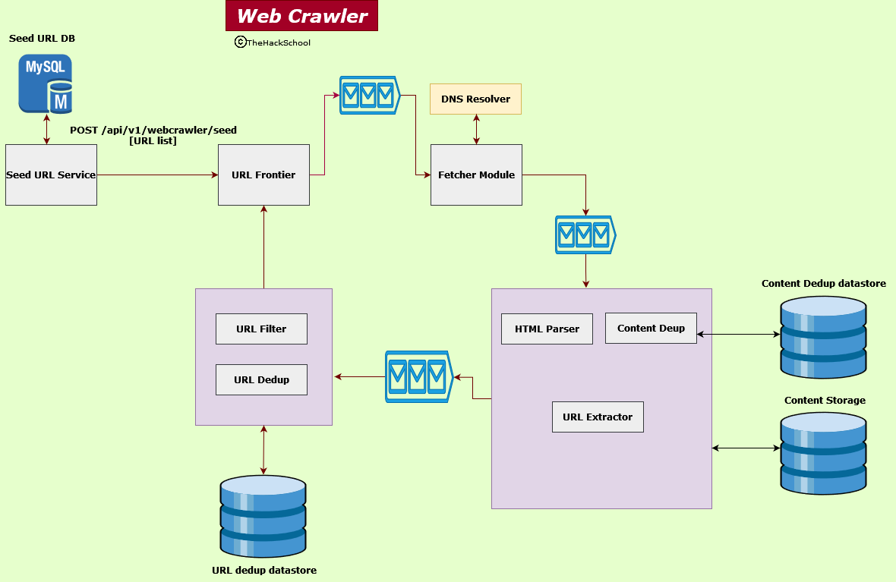

# WebCrawler
A spider to crawl the entire web. Beware, spider supremacy is here.



## Seed URL Service

### Responsibilities
1. CRUD operations on the Seed URLs which are stored in a DB.
2. DB will be RDBMS. Tables - "urls", "categories".
3. Invoke a web crawler
4. Backend for frontend (BFF)

### APIs
- POST /api/v1/webcrawler/seedurls
```json
{
    "url": "url",
    "category": "category"
}
```
- GET /api/v1/webcrawler/seedurls/all
- PATCH /api/v1/webcrawler/seedurls
```json
{
    "id": "123",
    "url": "<new-url>",
    "category": "<new-category>"
}
```
- DELETE /api/v1/webcrawler/seedurls/{id}
- POST /api/v1/webcrawler/invoke

## URL Frontier Service

### Responsibilities
1. Reads Seed URLs from the **Seed URL Service** request.
2. Create one queue for every category of the seed URL. We will use Apache Kafka for it or other relevant queuing service like Rabbit MQ.
3. This service will act as the producer for the Kafka queue.

### APIs
- POST /api/v1/webcrawler/invoke
```json
{
    "urls": [
        {
            "url": "some url",
            "category": "category of the url"
        },
        {
            "url": "some url",
            "category": "category of the url"
        },
        {
            "url": "some url",
            "category": "category of the url"
        }
    ]
}
```

## URL Fetcher Service

### Responsibilities
1. This will act as the consumer of the Kafka queue
2. It will call the respective URL (we will use thread pool for this purpose)
3. This will interact with the DNS Resolver to convert URL to IP address.
4. Since DNS resolver is a bottleneck, with time, we will create our own DNS resolver service with the data accumulated over time.
5. We will honor robots.txt of different websites, and we will cache it. There should be a scheduler which should update the cached robots.txt
6. Server side rendering will also be a part of this module.
7. There will be Kafka between fetcher and parser module.


## HTML Parser + Content Deduplication + URL Extractor

1. Reads HTML string from the Kafka queue.
2. Parse the HTML and extract URLs from it.
3. Perform deduplication logic for the html string.
4. Save the unique content in the DB.
5. This service will use two DBs
    5.1 Checksum DB to read/write checksums of the content (key-value datastore)
    5.2 NoSQL DB for storing the content (NoSQL datastore like Mongo)
6. The extracted URLs will be places in a Queue for URL filter service to read.

## URL Filtering and Deduplication

1. Reads a URL from the Kafka queue.
2. Apply filtering logic as per our requirements
3. After filtering, apply the deduplication logic.
4. Checksums of all URLs will be stored in a DB and read from DB (key-value datastore).
5. This service will call the URL frontier service with list of URLs.

## Setup required

- [x] RDBMS for Seed URL
- [ ] NoSQL for storing HTML content
- [ ] Key-Value datastore for content dedup checksums
- [ ] Key-Value datastore for URL dedup checksums
- [ ] Kafka queues to add between URL frontier service and fetcher module. This will store URLs in a topic based on URL hostname.
- [ ] Kafka queue between fetcher and HTML parser.
- [ ] Kafka queue between parser and URL filter.


## Commands for kafka : 
1. Zookeeper start
bin/zookeeper-server-start.sh config/zookeeper.properties
2. Kafka server start
bin/kafka-server-start.sh config/server.properties
3. If topic doesnt exist then create it with this command (top with crawler-urls created).
bin/kafka-topics.sh --create --topic crawler-urls --bootstrap-server localhost:9092
4. Producer attached to this topic added
bin/kafka-console-producer.sh --topic crawler-urls --bootstrap-server localhost:9092 
5. Consumer listening to topic crawler-urls up. 
bin/kafka-console-consumer.sh --topic crawler-urls --from-beginning --bootstrap-server localhost:9092


MYSQL : 
1. starting the sql server 
- mysql.server start        

2. To connect to sql 
- mysql -u root       


